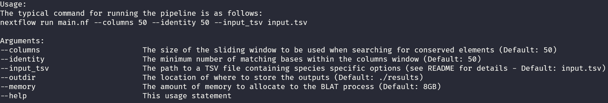
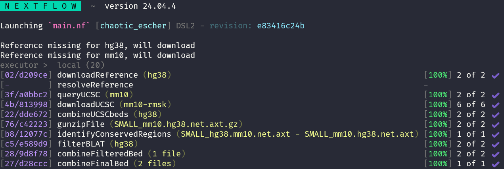

# nf-CNE

A Nextflow pipeline for identifying conserved non-coding elements 

## Dependencies

- Nextflow >= 24.04.4 (earlier versions may work but have not been tested)
- conda

## Inputs

- The primary input is a TSV file, by default [input.tsv](input.tsv), though this can be changed with the `--input_tsv` parameter. Each row is a species to include in the comparison, if two species are provided CNEs will be generated from pairwise alignments, if three or more species are provided then multi-sequence alignment will be used (This is not yet supported and is planned for a future release). This file contains:

    - species - The species name to be queries (e.g. `hg38` or `mm10`)
    - reference - The path to a locally stored reference for the species (either a path to the reference file or a directory containing the reference files). This is optional and will be downloaded from UCSC if not provided
    - chain - The path to the pairwise alignment for which the species is the target (e.g. if the species are `hg38` or `mm10` then the chain path for the `hg38` row should be `hg38.mm10.net.axt.gz` and the mm10 row `mm10.hg38.net.axt.gz`). This is optional and will be generated if not provided. - PENDING
        - If you have multiple files for a species pair (e.g. `chr1.mm10.hg38.net.axt.gz`) then the helper script [pairwise_identification/combine_files.py](pairwise_identification/combine_files.py) can be used to merge them.
    - UCSC_filters - an optional comma separated list of UCSC tracks for down to be used as filters when identifying conserved regions. If any provided tracks are not found for that species the full list of valid tracks will be printed out
    - Tool_Filters - an optional comma separated list of tool based filters to apply. Currently only BLAT is supported
    - BLAT_hits_threshold - The maximum number of BLAT hits a conserved element can have before being discarded. Required is BLAT is specified
    - BLAT_identity_threshold - The minimum percentage identity a BLAT hit has to have to be counted towards the above threshold. Required is BLAT is specified

- Additional options are `--columns` and `--identity`. Columns is the size of the sliding window to be used when searching for conserved elements and identity is the minimum number of matching bases within that window. By default these are both `50`

- Running `nextflow run main.nf --help` will print a usage message detailing all available parameters:

## Example Run

- `nf-CNE` can be used on the example data straight away by running `nextflow run main.nf`, this will use [input.tsv](input.tsv) which uses small pairwise alignments files of `hg38` and `mm10`, located in [example_inputs](example_inputs), with a `columns` and `identity` of 50, the UCSC tracks `gap`, `rmsk` and `ncbiRefSeqCurated`, along with the `BLAT` filter:

 

## Outputs

- Unless changed with the `--outdir` parameter, outputs will be located in `./results`. The directories will be:
    - reference - If the reference files were not provided they will be downloaded and stored here, with sub-directories for each species
    - UCSC_bed - If UCSC tracks were provided the downloaded BED files will be stored here. Files are named `<species>_<track>.bed`. If multiple tracks were downloaded for a species then a merged track will also be present, named `<species>_<track_1>_<track_2>_<track_n>.bed`, where the track names are alphabetically  sorted to ensure consistent naming
    - unfiltered - This contains the output of the `pairwise_identification` step, containing putative CNEs prior to any tool based filtering
    - BLAT_filtered - If `BLAT` was selected to be run then this will contain the putative CNEs that passed the BLAT filtering step
    - COMBINED_filtered - Only putative CNEs that passed all tool based filters are included here (although currently only BLAT is supported, this combining step was included to make incorporating additional filters easier in the future)
    - FINAL_FILTERED - Only CNEs that passed all tool filters and are present in all species are included here. This is the "final" output of `nf-CNE`

## Future Plans

- Incorporate CNE detection from multiple sequence alignments (MSAs)
- Add additional tool filters
